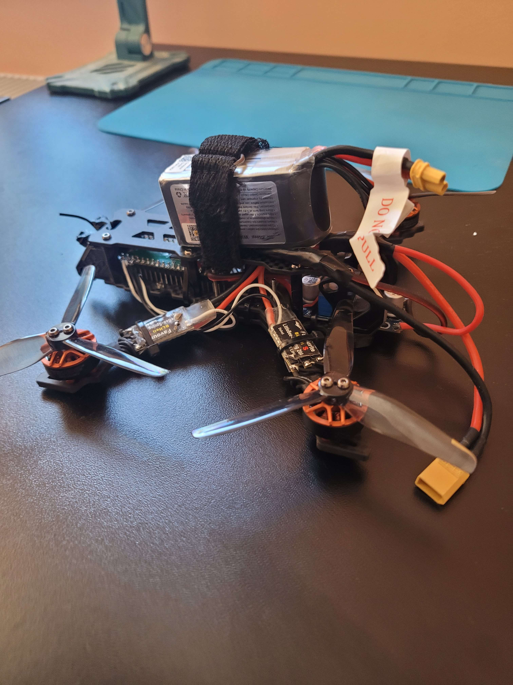

# BasiqFC

(**B**eautifull (or bad) **a**nd **s**imple **i**mplemented **q**uadcopter) BASIQ FC for rp2040 quadcopter on Raspberry pi pico

## I knew nothing before this project 

I want to show and maybe inspire people that never done this type of project that it's actually possible to do and you don't have to be some crazy programmer to have fun and do somenthing bigger than simple led blink. 

Before this project i knew nothing about quadcopters, types of sensors and did only basic i2c protocol sensors on arduino and some led blinking on raspberry pi pico. 

## Quadcopter implementation for my engineering thesis 

Because it is for my univesity of technology some things are not necessary for this project but i used them to expplain what i did. Some comments are also usefull only for my thesis so keep that in mind. Propably will do 2nd version of this not for my university.

## This is my first big project 

Because of that there are probably many mistakes so look at the code with a grain of salt. Nonetheless i hope that this code can be useful for some beginners.

## Features 

### Sensors
- [X] IMU (without magnetometer so no yaw stabilization)
- [X] Barometer (there is code for it but not implemented on actual board)
- [ ] GPS
- [ ] Lidar or other distance sensor
- [ ] Camera 

### Transmitter receiver protocols
- [X] CSRF
- [ ] Frsky

### ESC Protocols

- [ ] PWM (50 hz)
- [X] Oneshot125
- [ ] Oneshot42
- [ ] Multishot
- [ ] Dshot150
- [ ] Dshot300
- [ ] Dshot600
- [ ] Dshot1200
- [ ] ProShot

### Flight modes
- [X] Acro 
- [ ] Angle (There is code for it but it does not work :< will need to fix it some time later) 
- [ ] GPS Rescue 
- [ ] GPS Mapping 

## Future plans 

- Fixing if possible angle mode.
- Adding battery level control 
- Adding some way to save data during flight either through flash or SD card.
- Porting code to RTOS platform would be nice.
- Adding GPS module for full position hold.
- ...
